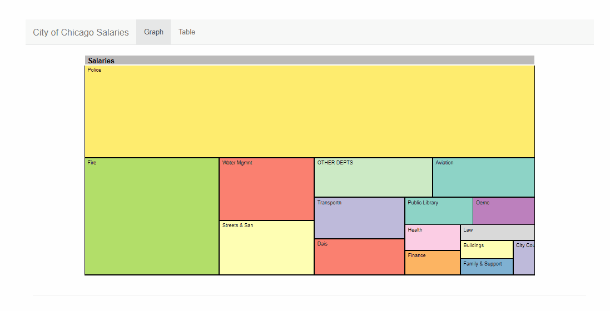
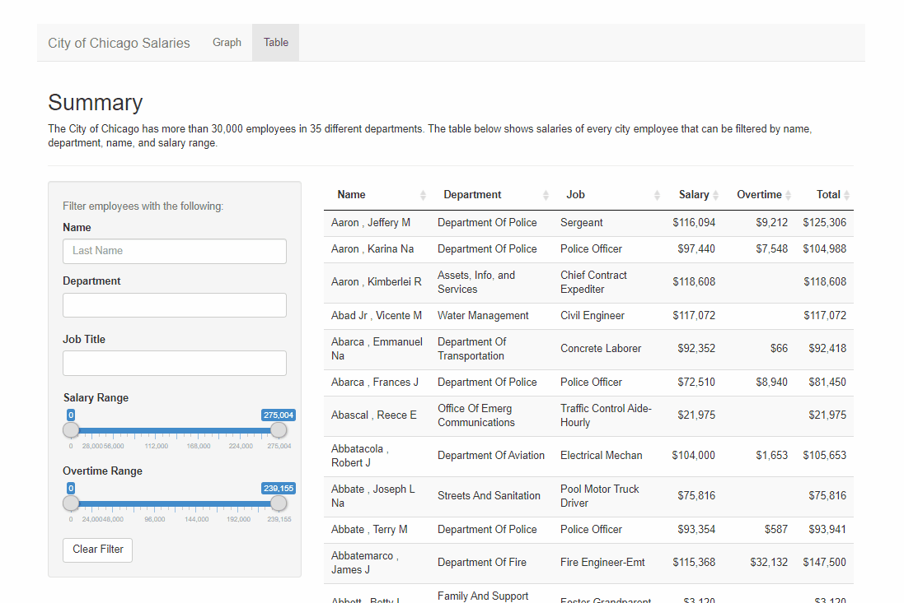

## 2020 City of Chicago Salaries

http://chicago-salary.herokuapp.com/

This R Shiny app shows salaries for Chicago of Chicago employees in calendar year 2020. The goal of this project is to 
visually represent how the city allocates its salary budget, and to filter each employees by department and pay. 

The idea for this project came from the [numerous](https://www.chicagotribune.com/politics/ct-chicago-overtime-unrest-lightfoot-20201006-tjiqh37anjdf5lilbpodk7blva-story.html)
 [media](https://chicago.suntimes.com/2020/12/15/22176533/chicago-police-overtime-hire-more-not-reduce-workforce-letters)
  [coverage](https://chicago.suntimes.com/2020/8/6/21355968/chicago-police-department-overtime-spending-crime-murders-protests) 
  that Chicago received for its overtime budget in 2020, and also from working at the CPD Training Division earlier this year.


Here are the departments sorted by highest allocation of salary + overtime pay:
- Police: 43.9%
- Fire: 17.7%
- Water Mgmt: 6.2%
- Sanitation: 5.7%
- Aviation: 4.8%
- Transportation: 3.6%

## Layout 

### Treemap:


### Table:


## Data

Salary dataset for current City fo Chicago employees is available on the [Chicago Open Data](https://data.cityofchicago.org/Administration-Finance/Current-Employee-Names-Salaries-and-Position-Title/xzkq-xp2w/data)
portal. The website does not show overtime pay, paid time off, or other supplemental earnings for its employees. Overtime earnings
for each employee by month and year-to-date is available [here](https://data.cityofchicago.org/browse?q=overtime&sortBy=relevance),
but employee names are missing for some years, and for 2020 the most recent data is up to August. 

I received the overtime data 
through Chicago Finance FOIA-request [here](https://www.chicago.gov/city/en/depts/fin/supp_info/fin_foia.html) and stored it in `/data`.

The data does not include employees working for Chicago Public Schools, Chicago Transit Authority, METRA, Cook County, or the state of Illinois.

## Folder Structure

```
.
├── app                 # Shiny app files (user interface object `ui.R`, server function `server.R`, etc.)
├── data                # Salary data and cleanup files
├── figures             # Treemap files 
├── run.R               # Starts the Shiny App
├── init.R              # Installs R packages
└── README.md
```

## Deployment

The app was deployed using Heroku:

```
# Create the Heroku app
heroku apps:create APPNAME

# Reinitialize and commit to git
git init
git add . && git commit -m "commit message"

# Tell Heroku to use a custom R Shiny buildpack for the app
heroku create --buildpack https://github.com/virtualstaticvoid/heroku-buildpack-r.git

# Deploy
git push heroku main
```
